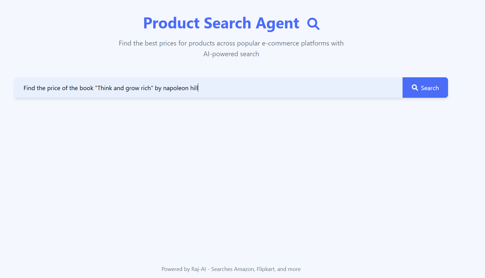
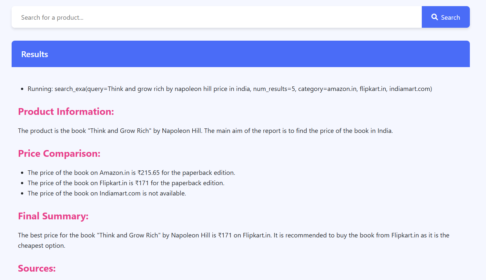

<h1 align="center">🛍️ Product Search Agent</h1>
<h3 align="center"> AI-powered Product search agent that can search for products across ecommerce web and ecommerce platforms. </h3>

<p align="center">
  
  
  
  
  
  
</p>

<br>

## 📌 Overview
The **Product Search Agent** is an AI-powered web application that allows users to search for product details, including price comparisons, from multiple online sources. It leverages various agentic tools and Large Language Models (LLMs) to fetch, analyze, and present product information.

<br>

## 🌟 Features
- 🔍 **Product Information Retrieval**: Fetches product details from multiple e-commerce platforms.
- 💰 **Price Comparison**: Compares prices from Amazon, Flipkart, and other supported sites.
- 🌍 **Web Search Capabilities**: Utilizes AI-powered search tools for accurate results.
- 🖥 **Modern UI**: A clean, user-friendly interface built with Flask and HTML/CSS.
- 📄 **Structured Response**: Provides formatted responses with product details, pricing, and best recommendations.

<br>

## 🛠 Tech Stack
| Technology | Description |
|------------|-------------|
| **Python** | Programming language used  |
| **Agno AI (formerly Phidata)** | AI framework for building agents and tools |
| **Exa Tools** | Web search tool for retrieving product details |
| **SerpApiTools** | Search engine results page to find product informations |
| **GoogleSearchTools** | Google Search tools to search for products |
| **Together AI** | LLM for natural language processing |
| **Flask** | Web framework for UI and API integration |
| **HTML & CSS** | Frontend design and styling |

<br>

## 📂 Project Structure
```
/📂Product-Search-Agent-WebApp
│── /📂static
│   ├── styles.css  # CSS for UI styling
│── /📂templates
│   ├── index.html  # Main webpage template
│── app.py  # Flask backend
│── agent_builder.py  # AI agent logic
│── exception.py  # Custom exception handling
│── requirements.txt  # Python dependencies
│── .env  # Environment variables
```

<br>

## 🚀 Installation & Setup

### 1️⃣ Clone the Repository
```sh
git clone https://github.com/Dhanush-Raj1/Product-Search-Agent-Project.git
cd Product-Search-Agent-WebApp
```

### 2️⃣ Create a Virtual Environment
```sh
python -m venv venv
source venv/bin/activate   # On macOS/Linux
venv\Scripts\activate      # On Windows
```

### 3️⃣ Install Dependencies
```sh
pip install -r requirements.txt
```

### 4️⃣ Set Up Environment Variables
Create a `.env` file in the root directory and add:
```sh
TOGETHER_API_KEY=your_together_ai_api_key
EXA_API_KEY=your_exa_api_key
SERPAPI_API_KEY=your_serpapi_key
```

### 5️⃣ Run the Flask App
```sh
python app.py
```

The app will be available at: **http://127.0.0.1:5000/**

<br>

## 🌐 Usage Guide  
1️⃣ Open the web app in your browser.  
2️⃣ Enter a search query (e.g., *Find the price iphone 14 pro*).  
3️⃣ Click the **Search** button.  
4️⃣ View the retrieved product details and price comparisons.  

<br>

## 📸 Screenshots
### 🔵 Home Page

<br>
### 🟢 Search Results


<br>

## 📌 Future Enhancements
✅ Add more e-commerce websites for price comparison.
✅ Implement real-time currency conversion.
✅ Improve UI with a more interactive design.
✅ Optimize LLM prompts for better response accuracy.
✅ Add user authentication for personalized recommendations.

<br>

## 🤝 Contributing
💡 Have an idea? Feel free to contribute or open an issue and pull requests! 

## 📄 License
This project is licensed under the **MIT License** – see the [LICENSE](LICENSE) file for details.

---
